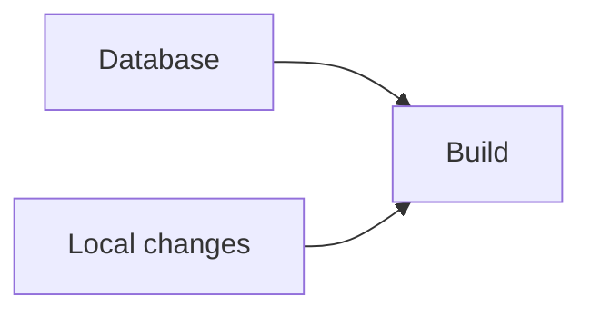

# Markdown

Notes on how authored content is processed through mdsvex.

## mdsvex

mdsvex is a markdown preprocessor for Svelte. It compiles `.md` files into Svelte components at
build time. This means:

- Markdown files can be used as SvelteKit page components directly.
- Svelte components can be imported and used inside markdown.
- All rendering happens at build time, so SEO is unaffected.

## Component Remapping

Default HTML elements (headings, code blocks, links, etc.) can be remapped to custom Svelte
components via an mdsvex layout. Content authors write standard markdown. The presentation logic
lives in the components.

This was chosen over writing a custom markdown parser. Full control over every element's rendering
without maintaining a parser.

## Layouts

Named mdsvex layouts are registered in `svelte.config.js`. Articles select one via the `layout`
frontmatter key:

| Key        | Component                        | Used by        |
| ---------- | -------------------------------- | -------------- |
| `docs`     | `src/lib/layouts/Article.svelte` | Profilarr docs |
| `dev-logs` | `src/lib/layouts/Article.svelte` | Dev logs       |
| `wiki`     | `src/lib/layouts/Article.svelte` | Wiki articles  |

All three layers share `Article.svelte`: same page header and AI menu. Docs pages leave out the
author, date, and tags, which the layout treats as optional. There is no fallback layout; all `.svx`
files live under `docs/`, `dev-logs/`, or `wiki/`. The table of contents is not part of the layout:
the root layout mounts it globally beside any page that renders an `<article>` (see
[ui.md](./ui.md)).

## Plugins

mdsvex bundles an older remark, so remark plugins are pinned to the last majors that target its
tree. Newer versions expect a micromark-based pipeline and fail silently or loudly.

| Plugin                | Version pin | Purpose                                           |
| --------------------- | ----------- | ------------------------------------------------- |
| `remark-math`         | `3.x`       | Parses `$...$` and `$$...$$` math syntax          |
| `rehype-katex-svelte` | current     | Renders math to KaTeX HTML escaped for Svelte     |
| `rehype-slug`         | current     | Heading ids for the table of contents and anchors |

KaTeX rendering happens at build time; the KaTeX stylesheet is imported per-article in the
`<script>` block of articles that use math, so non-math pages don't ship it.

## Diagrams

Fenced code blocks with the `mermaid` language render to inline SVG at build time. The mdsvex
`highlighter` in `svelte.config.js` sends them to `mermaidBlock` in `tooling/markdown/mermaid.ts`
and passes every other language to mdsvex's default Prism highlighter. The Markdown mirrors ship the
fence source verbatim (see [llm.md](../backend/llm.md#docs-dev-log-and-wiki-artifacts)), so models
read the Mermaid and browsers get the SVG. No Mermaid JavaScript reaches the browser.

````md

````

Every diagram needs an `accDescr` line, and the build fails without one. `accTitle` is optional.
Both must be single lines; the block form (`accDescr { ... }`) is not supported. They become the
SVG's `<title>` and `<desc>`, which screen readers read.

Rendering uses [beautiful-mermaid](https://github.com/lukilabs/beautiful-mermaid), which lays
diagrams out without a browser. Its output needs four changes before it goes on a page, all made in
`mermaid.ts`:

- Its `<style>` block imports the font from Google Fonts and styles every `svg` and `text` on the
  page. The imports and font rules are removed, the rest is scoped to the diagram, and
  `src/styles/prose.css` sets the fonts.
- Its marker ids are fixed. Every id is prefixed with a hash of the diagram source, so diagrams on
  the same page don't repeat ids.
- It draws `accTitle` and `accDescr` as nodes. They are removed before rendering and added back as
  `<title>` and `<desc>`.
- It draws flowchart edges as right-angled polylines. `edgePath` redraws them as paths with each
  corner replaced by a curve, so a short step between two nodes becomes an S-curve. The route is
  unchanged, which keeps edge labels on the line.

Colors come from the theme tokens (`--theme-bg`, `--theme-text`, and so on), so diagrams follow
theme switches without re-rendering. Corners come from the radius tokens: `prose.css` sets `rx` and
`ry`, which work as CSS properties on SVG rects, on rectangle nodes (`--theme-radius-control`), edge
labels (`--theme-radius-control-sm`), and subgraphs (`--theme-radius-card`, with a dashed outline).
Retro's square radii give square diagrams. A subgraph's header band is hidden, since its square
corners would stick out of the rounded outline.

The package is pinned to an exact version because these changes depend on its output shape.
`tests/tooling/mermaid.test.ts` fails if an update changes it, and Dependabot opens its updates as
separate PRs so the tests check each one.

## Frontmatter

Markdown files use YAML frontmatter for metadata. Frontmatter values are used for SEO meta tags,
search indexing, and content listing/sorting.

The article frontmatter shared by dev logs and wiki articles, and the docs frontmatter, are
documented in [backend/content.md](../backend/content.md).
